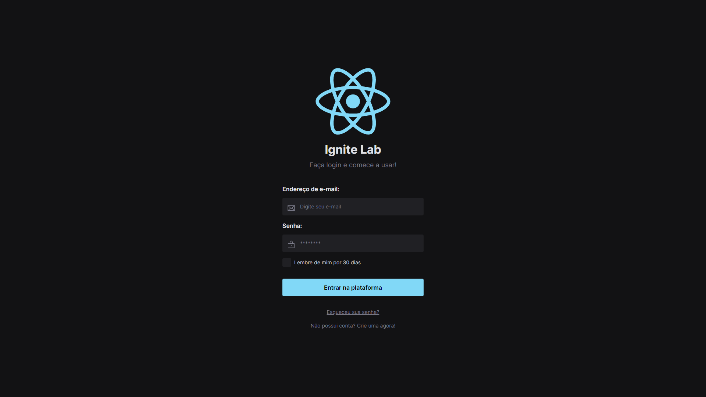

# Ignite Lab Design System - Rocketseat

## Aula 01
Desenvolvimento da base visual do projeto de Design System via Figma, definindo tokens e componentes que farão parte da biblioteca em React.

## Aual 02
Exportando tokens e componentes do Figma para o código, criação da base do projeto em React e documentação em Storybook.

## Aula 03
Criando testes automatizados para o Design System, simulando interações do usário e automatizando o processo de deploy.
